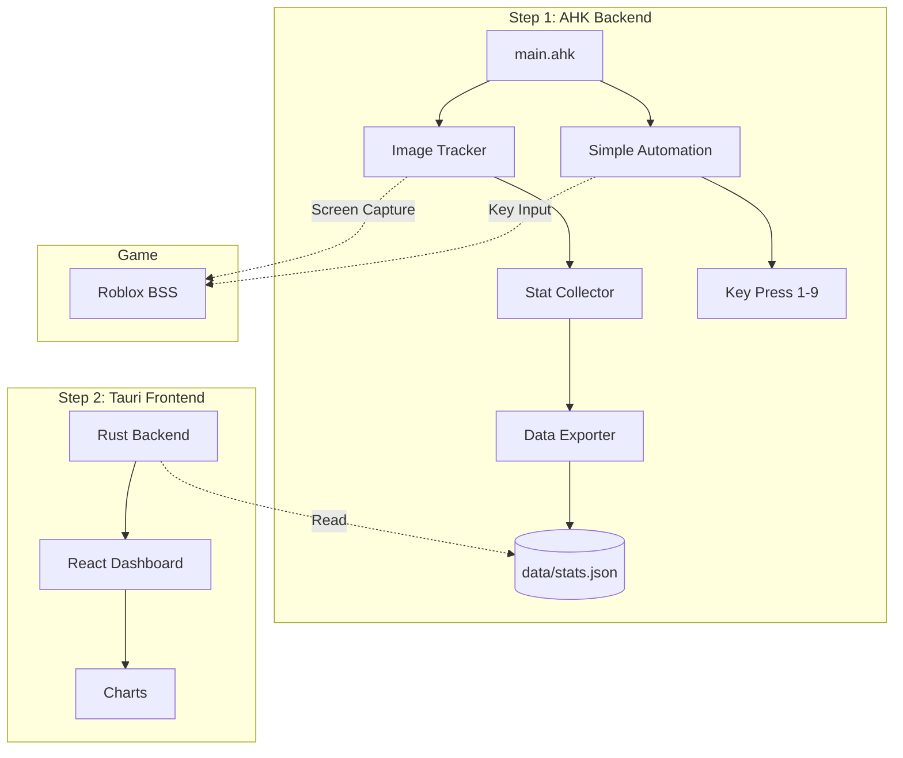

# White Macro BSS - Tổng Quan Dự Án

## 🎯 Mục Tiêu

**White Macro BSS** là công cụ **theo dõi và thu thập thống kê** cho game Bee Swarm Simulator (Roblox), sử dụng AutoHotkey v2 với GDI+ image tracking.

> [!NOTE]
> Đây KHÔNG phải macro tự động hóa đầy đủ như Natro Macro. Mục tiêu chính là **thu thập dữ liệu** để phân tích gameplay.

## 📊 Tính Năng Chính

### Step 1: MVP (AutoHotkey + Windows GUI)

| Tính năng | Mô tả |
|-----------|-------|
| **Stat Tracking** | Theo dõi tiền, tài nguyên theo thời gian |
| **Rate Calculator** | Tính tốc độ tăng/giây, /phút |
| **Skill Monitor** | Theo dõi kỹ năng đang sử dụng |
| **Simple Automation** | Tự động bấm phím 1-9, `<` `>` |
| **Alert System** | Cảnh báo khi cần dùng vật phẩm |
| **Data Export** | Xuất dữ liệu JSON cho phân tích |

### Step 2: Frontend (React + Tauri + Rust)

| Tính năng | Mô tả |
|-----------|-------|
| **Dashboard** | Giao diện thống kê trực quan |
| **Charts** | Đồ thị phát triển theo thời gian |
| **Analysis** | Phân tích hiệu suất gameplay |

---

## 🏗️ Kiến Trúc



---

## 📁 Cấu Trúc Thư Mục

```
ahk-White-macro-bss/
├── src/                 # Mã nguồn AHK
│   ├── core/            # Logic cốt lõi (image tracking, state)
│   ├── modules/         # Các module tính năng
│   └── utils/           # Tiện ích (logger, config)
│
├── lib/                 # Thư viện bên ngoài (từ Natro)
├── assets/              # Hình ảnh, paths, patterns
├── data/                # Runtime data, logs
├── docs/                # Tài liệu (đang đọc)
└── frontend/            # [Step 2] React + Tauri
```

---

## 🔧 Công Nghệ

| Layer | Công nghệ | Mục đích |
|-------|-----------|----------|
| Backend | AutoHotkey v2 | Image tracking, automation |
| Graphics | GDI+ (Windows) | Screen capture, image search |
| Data | JSON | Lưu trữ, trao đổi dữ liệu |
| Frontend | React + Tauri + Rust | Dashboard, charts |

---

## 📚 Tài Liệu Liên Quan

- [01 - Hướng dẫn học AHK](./01-ahk-basics.md)
- [02 - Kiến trúc dự án](./02-project-architecture.md)
- [03 - Nghiên cứu Natro Macro](./03-natro-macro-research.md)
- [04 - Hướng dẫn Tauri/Rust](./04-tauri-rust-guide.md)

---

## 🚀 Bắt Đầu

```bash
# 1. Cài đặt AutoHotkey v2
# https://www.autohotkey.com/

# 2. Chạy macro
./START.bat
```
