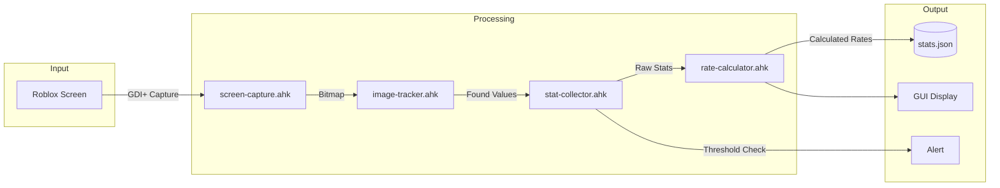
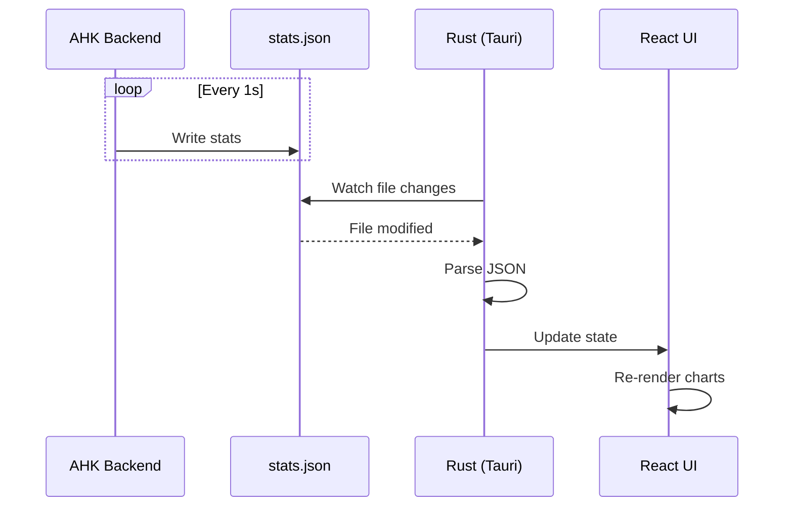
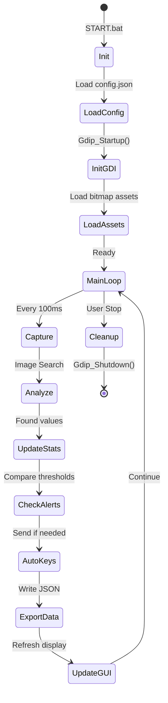

# Kiến Trúc Dự Án White Macro BSS

## 📁 Cấu Trúc Chi Tiết

```
ahk-White-macro-bss/
│
├── 📁 src/                         # Mã nguồn AHK chính
│   ├── main.ahk                   # Entry point
│   ├── gui.ahk                    # Windows GUI
│   │
│   ├── 📁 core/                   # Logic cốt lõi
│   │   ├── image-tracker.ahk      # Wrapper cho GDI+ image search
│   │   ├── screen-capture.ahk     # Chụp màn hình
│   │   └── state-manager.ahk      # Quản lý trạng thái
│   │
│   ├── 📁 modules/                # Các module tính năng
│   │   ├── stat-collector.ahk     # Thu thập thống kê
│   │   ├── rate-calculator.ahk    # Tính tốc độ tăng
│   │   ├── skill-monitor.ahk      # Theo dõi kỹ năng
│   │   ├── alert-system.ahk       # Hệ thống cảnh báo
│   │   └── auto-keys.ahk          # Tự động bấm phím
│   │
│   └── 📁 utils/                  # Tiện ích
│       ├── logger.ahk             # Ghi log
│       ├── config.ahk             # Quản lý cấu hình
│       └── data-exporter.ahk      # Xuất dữ liệu JSON
│
├── 📁 lib/                         # Thư viện bên ngoài
│   ├── Gdip_All.ahk               # GDI+ wrapper (từ Natro)
│   ├── Gdip_ImageSearch.ahk       # Image search (từ Natro)
│   ├── JSON.ahk                   # JSON parser
│   ├── Roblox.ahk                 # Roblox utilities
│   └── HyperSleep.ahk             # High-precision sleep
│
├── 📁 assets/                      # Tài nguyên
│   ├── 📁 images/                 # Hình ảnh tracking
│   │   ├── currency/              # Icons tiền, tài nguyên
│   │   ├── skills/                # Icons kỹ năng
│   │   ├── items/                 # Icons vật phẩm
│   │   └── ui/                    # UI elements
│   │
│   ├── 📁 paths/                  # [Tương lai] Đường đi
│   └── 📁 patterns/               # [Tương lai] Mẫu di chuyển
│
├── 📁 data/                        # Dữ liệu runtime
│   ├── config.json                # Cấu hình người dùng
│   ├── stats.json                 # Thống kê thu thập
│   └── 📁 logs/                   # Log files
│
├── 📁 docs/                        # Tài liệu
│
├── 📁 frontend/                    # [Step 2] React + Tauri
│   ├── 📁 src/                    # React source
│   ├── 📁 src-tauri/              # Rust backend
│   └── package.json
│
├── START.bat                       # Khởi động macro
└── .gitignore
```

---

## 🔄 Data Flow



---

## 🧩 Module Descriptions

### Core

| Module | Trách nhiệm |
|--------|-------------|
| `image-tracker.ahk` | Wrapper đơn giản cho Gdip_ImageSearch, cache bitmap |
| `screen-capture.ahk` | Chụp vùng cụ thể của Roblox window |
| `state-manager.ahk` | Lưu trạng thái game, previous values |

### Modules

| Module | Trách nhiệm |
|--------|-------------|
| `stat-collector.ahk` | Thu thập Honey, Pollen, tickets... |
| `rate-calculator.ahk` | Tính ΔValue/Δt (per second, minute) |
| `skill-monitor.ahk` | Detect kỹ năng đang active |
| `alert-system.ahk` | Cảnh báo âm thanh/visual |
| `auto-keys.ahk` | Gửi phím 1-9, `<` `>` |

### Utils

| Module | Trách nhiệm |
|--------|-------------|
| `logger.ahk` | Ghi log theo level (debug, info, warn, error) |
| `config.ahk` | Load/save config.json |
| `data-exporter.ahk` | Xuất stats.json cho frontend |

---

## 🔗 Giao Tiếp AHK ↔ Tauri (Step 2)

### Phương án đề xuất: **File JSON + File Watcher**



**Ưu điểm:**
- Đơn giản, không cần socket/HTTP
- Dễ debug (xem file trực tiếp)
- AHK và Tauri hoàn toàn độc lập

**File format:**
```json
{
  "timestamp": 1702296847,
  "session": {
    "startTime": 1702293247,
    "duration": 3600
  },
  "stats": {
    "honey": 1500000,
    "honeyRate": 250.5,
    "pollen": 45000,
    "pollenRate": 75.2
  },
  "skills": {
    "active": ["Bear Morph", "Coconut"],
    "cooldowns": {}
  },
  "alerts": []
}
```

---

## 🚀 Execution Flow



---

## Tiếp Theo

- [03 - Nghiên cứu Natro Macro](./03-natro-macro-research.md)
- [04 - Hướng dẫn Tauri/Rust](./04-tauri-rust-guide.md)
