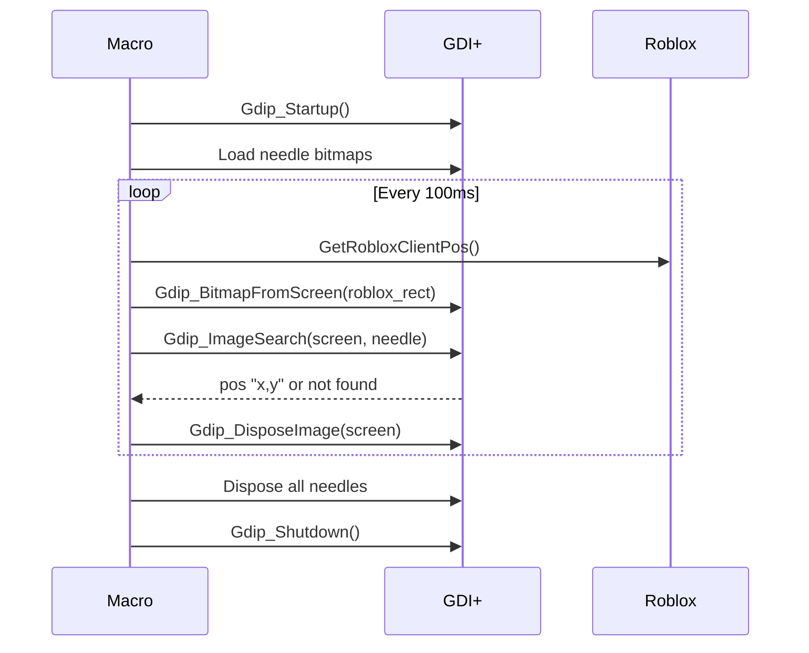

# Nghiên Cứu Natro Macro

## 📖 Giới Thiệu

Tài liệu này phân tích sâu mã nguồn **Natro Macro** để tham khảo khi phát triển White Macro BSS.

> [!TIP]
> Natro Macro là macro hoàn chỉnh cho BSS với 22,000+ dòng code. Chúng ta chỉ cần tham khảo phần **image tracking** và **utilities**.

---

## 🗂️ Cấu Trúc Natro Macro

```
ahk-Natro-macro-fork/
├── lib/                    # Thư viện core ⭐
│   ├── Gdip_All.ahk        # GDI+ wrapper
│   ├── Gdip_ImageSearch.ahk # Image search
│   ├── Roblox.ahk          # Roblox utilities
│   ├── JSON.ahk            # JSON parser
│   └── ...
│
├── submacros/              # Macro chính
│   └── natro_macro.ahk     # 22,000+ lines
│
├── nm_image_assets/        # Hình ảnh tracking ⭐
│   ├── *.png               # Buttons, icons
│   └── Styles/             # GUI themes
│
├── patterns/               # Mẫu di chuyển
└── paths/                  # Đường đi định sẵn
```

---

## 🔍 Thư Viện Cốt Lõi

### 1. Gdip_All.ahk

**Mục đích**: Wrapper cho Windows GDI+ API

**Hàm quan trọng**:

| Hàm | Mô tả |
|-----|-------|
| `Gdip_Startup()` | Khởi tạo GDI+ (bắt buộc) |
| `Gdip_Shutdown(pToken)` | Kết thúc GDI+ |
| `Gdip_BitmapFromScreen(rect)` | Chụp màn hình |
| `Gdip_CreateBitmapFromFile(path)` | Load ảnh từ file |
| `Gdip_DisposeImage(pBitmap)` | Giải phóng bitmap |
| `Gdip_SaveBitmapToFile(pBitmap, path)` | Lưu bitmap |

**Ví dụ**:
```autohotkey
pToken := Gdip_Startup()
pBM := Gdip_BitmapFromScreen("0|0|800|600")
Gdip_SaveBitmapToFile(pBM, "screenshot.png")
Gdip_DisposeImage(pBM)
Gdip_Shutdown(pToken)
```

---

### 2. Gdip_ImageSearch.ahk

**Mục đích**: Tìm hình nhỏ trong hình lớn

**Signature**:
```autohotkey
Gdip_ImageSearch(pBitmapHaystack, pBitmapNeedle, &OutputList
    , OuterX1:=0, OuterY1:=0, OuterX2:=0, OuterY2:=0
    , Variation:=0, Trans:=""
    , SearchDirection:=1, Instances:=1)
```

**Parameters quan trọng**:

| Param | Mô tả |
|-------|-------|
| `pBitmapHaystack` | Bitmap màn hình |
| `pBitmapNeedle` | Bitmap cần tìm |
| `&OutputList` | Kết quả "x,y" |
| `Variation` | Sai số màu (0-255) |
| `Trans` | Màu trong suốt |

**Return values**:
- `>= 0`: Số kết quả tìm được
- `-1001`: Invalid bitmap
- `-1002`: Invalid variation

---

### 3. Roblox.ahk

**Các hàm**:
```autohotkey
; Lấy handle cửa sổ Roblox
GetRobloxHWND()

; Lấy vị trí/kích thước
GetRobloxClientPos(&x, &y, &w, &h)

; Activate cửa sổ
ActivateRoblox()
```

---

### 4. JSON.ahk

```autohotkey
; Parse JSON
obj := JSON.parse(jsonString)

; Stringify
jsonString := JSON.stringify(obj)
```

---

## 🎯 Wrapper nm_imgSearch

Natro Macro tạo wrapper đơn giản:

```autohotkey
nm_imgSearch(fileName, v, aim := "full", trans := "none")
```

| Param | Mô tả |
|-------|-------|
| `fileName` | Tên file trong nm_image_assets/ |
| `v` | Variation (0-255) |
| `aim` | Vùng tìm: "full", "high", "low", "left", "right" |
| `trans` | Màu trong suốt |

**Return**: `[success, x, y]`
- `success = 0`: Tìm thấy
- `success = 1`: Không tìm thấy

---

## 📸 Hình Ảnh Assets (nm_image_assets)

### Cấu trúc
```
nm_image_assets/
├── e_button.png          # Nút E
├── honeyjar.png          # Honey jar icon
├── menu*.png             # Menu buttons
├── quest*.png            # Quest icons
├── buff*.png             # Buff icons
└── Styles/               # GUI themes
```

### Tips tạo assets
1. **Kích thước nhỏ**: Càng nhỏ càng tìm nhanh
2. **Màu đặc trưng**: Chọn vùng có màu độc nhất
3. **Không có text**: Text thay đổi theo ngôn ngữ
4. **Format PNG**: Hỗ trợ transparency

---

## 🔄 Workflow Tracking



---

## 💡 Áp Dụng Cho White Macro

### Cần sử dụng:
- ✅ `Gdip_All.ahk` - Toàn bộ
- ✅ `Gdip_ImageSearch.ahk` - Toàn bộ
- ✅ `Roblox.ahk` - Các hàm window
- ✅ `JSON.ahk` - Export data

### Không cần:
- ❌ `Walk.ahk` - Di chuyển tự động
- ❌ `paths/` - Đường đi
- ❌ `patterns/` - Mẫu di chuyển
- ❌ Logic automation trong natro_macro.ahk

### Tham khảo:
- 📖 Cách cache bitmap
- 📖 Cách tổ chức search areas
- 📖 Retry logic khi search thất bại

---

## 🔗 Links

- [Natro Macro Source](../../../ahk-Natro-macro-fork/)
- [Image Tracking Docs](../../../ahk-Natro-macro-fork/docs/02-image-tracking.md)
- [Project Structure](../../../ahk-Natro-macro-fork/docs/01-project-structure.md)
