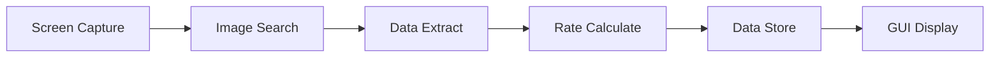
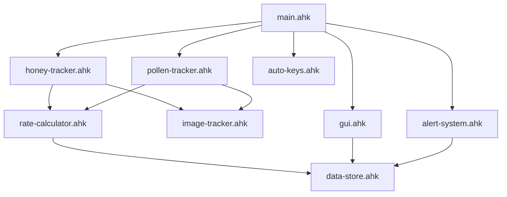

# MVP Blueprint - White Macro BSS (Step 1)

> 📋 **Tài liệu thiết kế MVP** - Có thể tùy chỉnh theo nhu cầu

---

## 1. Tổng Quan MVP

### Mục tiêu
Tạo công cụ **theo dõi và thu thập thống kê** gameplay BSS với:
- Image tracking theo dõi Honey, Pollen, resources
- Tính toán tốc độ tăng trưởng
- Lưu trữ dữ liệu JSON
- Windows GUI đơn giản

### Phạm vi MVP
| Có ✅ | Không ❌ |
|-------|----------|
| Stat tracking (Honey, Pollen) | Full automation |
| Rate calculation (/giây, /phút) | Path walking |
| Simple auto-keys (1-9) | Quest automation |
| Data export JSON | Cloud sync |
| Windows GUI | Web dashboard |

---

## 2. Tính Năng Chi Tiết

### 2.1 Core Features



| # | Tính năng | Mô tả | Ưu tiên |
|---|-----------|-------|---------|
| 1 | **Honey Tracking** | Theo dõi số lượng Honey | 🔴 High |
| 2 | **Pollen Tracking** | Theo dõi Pollen backpack | 🔴 High |
| 3 | **Rate Calculator** | Tính Honey/giây, Honey/phút | 🔴 High |
| 4 | **Session Stats** | Thống kê theo session | 🟡 Medium |
| 5 | **Auto Key Press** | Tự động bấm 1-9, `<` `>` | 🟡 Medium |
| 6 | **Alert System** | Cảnh báo khi đạt ngưỡng | 🟢 Low |
| 7 | **Data Export** | Xuất JSON cho Step 2 | 🟡 Medium |

### 2.2 User Stories

```
Là người chơi BSS, tôi muốn:
1. Xem được Honey hiện tại và tốc độ tăng
2. Biết được hiệu suất farming của mình
3. Tự động bấm phím kỹ năng
4. Lưu lại dữ liệu để phân tích sau
```

---

## 3. Data Schema (Cơ Sở Dữ Liệu)

### 3.1 stats.json - Runtime Stats

```json
{
  "version": "1.0",
  "lastUpdated": "2024-12-11T16:00:00",
  
  "session": {
    "id": "sess_20241211_160000",
    "startTime": "2024-12-11T16:00:00",
    "duration": 3600,
    "status": "running"
  },
  
  "current": {
    "honey": 1500000000,
    "pollen": 45000,
    "pollenMax": 100000
  },
  
  "rates": {
    "honeyPerSecond": 250.5,
    "honeyPerMinute": 15030,
    "pollenPerSecond": 75.2
  },
  
  "history": [
    {
      "timestamp": "2024-12-11T16:00:00",
      "honey": 1500000000,
      "pollen": 45000
    }
  ],
  
  "skills": {
    "lastUsed": {
      "1": "2024-12-11T16:05:00",
      "2": "2024-12-11T16:04:30"
    }
  }
}
```

### 3.2 config.json - User Settings

```json
{
  "tracking": {
    "enabled": true,
    "interval": 100,
    "trackHoney": true,
    "trackPollen": true,
    "historyMaxItems": 1000
  },
  
  "autoKeys": {
    "enabled": false,
    "keys": ["1", "2", "3"],
    "interval": 1000
  },
  
  "alerts": {
    "enabled": true,
    "pollenThreshold": 90,
    "sound": true
  },
  
  "ui": {
    "alwaysOnTop": true,
    "opacity": 90,
    "position": { "x": 100, "y": 100 }
  }
}
```

### 3.3 sessions.json - Session History

```json
{
  "sessions": [
    {
      "id": "sess_20241211_160000",
      "startTime": "2024-12-11T16:00:00",
      "endTime": "2024-12-11T18:00:00",
      "duration": 7200,
      "summary": {
        "honeyEarned": 500000000,
        "avgHoneyPerMin": 1157407,
        "pollenCollected": 150000
      }
    }
  ]
}
```

---

## 4. UI Design (Windows GUI)

### 4.1 Main Window Layout

```
┌─────────────────────────────────────────────────┐
│ White Macro BSS                          [_][X] │
├─────────────────────────────────────────────────┤
│  🍯 Honey: 1,500,000,000                        │
│     Rate: +15,030/min  (+250.5/sec)             │
│                                                 │
│  🌸 Pollen: 45,000 / 100,000  [████████░░] 45%  │
│     Rate: +75.2/sec                             │
├─────────────────────────────────────────────────┤
│  ⏱️ Session: 01:32:45                           │
│  📊 Total earned: +500,000,000 Honey            │
├─────────────────────────────────────────────────┤
│  ┌─────────────────────────────────────────┐    │
│  │ Auto Keys: [OFF]  Interval: [1000]ms    │    │
│  │ Keys: [1] [2] [3] [ ] [ ] [ ] [ ] [ ]   │    │
│  └─────────────────────────────────────────┘    │
├─────────────────────────────────────────────────┤
│  [▶ Start]  [⏸ Pause]  [📷 Screenshot]  [⚙️]   │
└─────────────────────────────────────────────────┘
```

### 4.2 Settings Window

```
┌─────────────────────────────────────────────────┐
│ Settings                                 [X]    │
├─────────────────────────────────────────────────┤
│ ┌─ Tracking ──────────────────────────────────┐ │
│ │ [✓] Track Honey                             │ │
│ │ [✓] Track Pollen                            │ │
│ │ Update interval: [100] ms                   │ │
│ └─────────────────────────────────────────────┘ │
│                                                 │
│ ┌─ Alerts ────────────────────────────────────┐ │
│ │ [✓] Enable alerts                           │ │
│ │ Pollen threshold: [90] %                    │ │
│ │ [✓] Play sound                              │ │
│ └─────────────────────────────────────────────┘ │
│                                                 │
│ ┌─ Window ────────────────────────────────────┐ │
│ │ [✓] Always on top                           │ │
│ │ Opacity: [90] %                             │ │
│ └─────────────────────────────────────────────┘ │
│                                                 │
│              [Save]  [Cancel]                   │
└─────────────────────────────────────────────────┘
```

### 4.3 Compact/Mini Mode

```
┌──────────────────────────────┐
│ 🍯 1.5B (+15K/m) 🌸 45% [▶]  │
└──────────────────────────────┘
```

---

## 5. Module Structure

### 5.1 File Map

```
src/
├── main.ahk                    # Entry point + hotkeys
├── gui.ahk                     # [NEW] Windows GUI
│
├── core/
│   ├── image-tracker.ahk       # ✅ Done (basic)
│   ├── screen-capture.ahk      # ✅ Done
│   └── state-manager.ahk       # [NEW] State management
│
├── modules/
│   ├── honey-tracker.ahk       # [NEW] Honey tracking
│   ├── pollen-tracker.ahk      # [NEW] Pollen tracking
│   ├── rate-calculator.ahk     # [NEW] Rate calculation
│   ├── auto-keys.ahk           # [NEW] Auto key press
│   └── alert-system.ahk        # [NEW] Alerts
│
└── utils/
    ├── logger.ahk              # ✅ Done
    ├── config.ahk              # ✅ Done
    ├── data-store.ahk          # [NEW] JSON CRUD
    └── formatter.ahk           # [NEW] Number formatting
```

### 5.2 Module Dependencies



---

## 6. Learning Roadmap

### Phase 1: AHK Basics (1-2 tuần)
```
[ ] Đọc docs/01-ahk-basics.md
[ ] Viết script Hello World
[ ] Hiểu biến, hàm, hotkey
[ ] Làm bài tập: tạo GUI đơn giản với Button, Text
```

### Phase 2: GDI+ Image Tracking (1-2 tuần)
```
[ ] Đọc docs/03-natro-macro-research.md
[ ] Hiểu Gdip_ImageSearch workflow
[ ] Thực hành: chụp và tìm hình đơn giản
[ ] Làm module honey-tracker.ahk
```

### Phase 3: Build MVP (2-4 tuần)
```
[ ] Tạo GUI chính (gui.ahk)
[ ] Implement honey + pollen tracking
[ ] Implement rate calculator
[ ] Implement data store
[ ] Tích hợp và test
```

### Phase 4: Polish (1 tuần)
```
[ ] Thêm auto-keys
[ ] Thêm alerts
[ ] UI improvements
[ ] Bug fixes
```

---

## 7. Development Checklist

### 🎯 Milestone 1: Core Tracking
- [ ] Tạo `honey-tracker.ahk` - detect honey value
- [ ] Tạo `pollen-tracker.ahk` - detect pollen value
- [ ] Tạo `rate-calculator.ahk` - tính rate
- [ ] Test với game thực tế

### 🎯 Milestone 2: Data Layer
- [ ] Tạo `data-store.ahk` - CRUD operations
- [ ] Implement `stats.json` schema
- [ ] Implement session tracking
- [ ] Export data cho Step 2

### 🎯 Milestone 3: GUI
- [ ] Tạo `gui.ahk` - main window
- [ ] Hiển thị stats realtime
- [ ] Settings window
- [ ] Compact mode

### 🎯 Milestone 4: Extras
- [ ] Auto keys feature
- [ ] Alert system
- [ ] Session history
- [ ] Performance optimization

---

## 8. Tùy Chỉnh

> [!TIP]
> Đây là template, bạn có thể tùy chỉnh theo nhu cầu!

### Thêm tính năng mới
1. Thêm vào bảng tính năng (Section 2)
2. Cập nhật Data Schema (Section 3)
3. Cập nhật UI Design (Section 4)
4. Thêm vào Checklist (Section 7)

### Thay đổi UI
- Vẽ lại layout trong Section 4
- Cập nhật `gui.ahk` tương ứng

### Thêm data fields
- Cập nhật JSON schema trong Section 3
- Implement trong `data-store.ahk`

---

## 9. Assets Cần Chuẩn Bị

### Hình ảnh tracking (từ nm_image_assets hoặc tự chụp)
```
assets/images/
├── honey_icon.png      # Icon honey jar
├── pollen_bar.png      # Pollen progress bar
├── digits/             # Số 0-9 để OCR (nếu cần)
│   ├── 0.png
│   ├── 1.png
│   └── ...
└── ui/                 # UI elements
    └── ...
```

---

## Next Steps

1. ✅ Review tài liệu này
2. 📖 Bắt đầu Phase 1: Học AHK Basics
3. 🖼️ Chuẩn bị assets hình ảnh
4. 💻 Code theo Milestone 1
